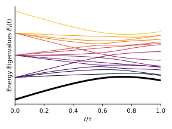
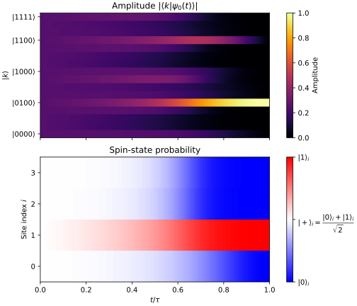

$$
  \global\def\ket#1{\left|#1\right\rangle}
  \global\def\bra#1{\left\langle#1\right|}
$$

量子アニーリングは、Isingスピングラス模型で表される組合せ最適化問題の最適解を探す量子計算手法です。基底状態が自明な量子系から出発し、ハミルトニアンをゆっくり変化させることで、解きたい問題に対応する基底状態を得ることを目指します。

量子アニーリングで一般的に使われるハミルトニアンは、次のように定義されます。

$$
  \hat{H}(t)
  =
  \left(1-\frac{t}{\tau}\right)\hat{H}_0
  +
  \frac{t}{\tau}\hat{H}_1,
  \qquad 0 \leq t \leq \tau.
$$

ただし

$$
\begin{aligned}
  \hat{H}_0
  &=
  -\sum_{i=1}^{N}\hat{\sigma}_i^x,
  \\
  \hat{H}_1
  &=
  -\sum_{i<j}J_{ij}\hat{\sigma}_i^z\hat{\sigma}_j^z
  -
  \sum_i h_i\hat{\sigma}_i^z.
\end{aligned}
$$

$\hat{H}_0$ はドライバーハミルトニアンで量子効果を表す横磁場項、$\hat{H}_1$ は目的ハミルトニアンで問題を表す項、そして $\tau$ はアニーリング時間です。

$t=0$ と $t=\tau$ それぞれにおいて

$$
  \hat{H}(0)=\hat{H}_0,
  \qquad
  \hat{H}(\tau)=\hat{H}_1
$$

となります。初期時刻では第1項が支配的であり、終時刻では第2項が支配的です。

## 時間発展

時間とともに変化する量子状態 $\ket{\psi(t)}$ は、Schrödinger 方程式

$$
  i\hbar\frac{\partial}{\partial t}\ket{\psi(t)}
  =
  \hat{H}(t)\ket{\psi(t)}
$$

に従います。ハミルトニアンが時間に依存しない場合は、固有値問題

$$
  \hat{H}\ket{E_n}
  =
  E_n\ket{E_n}
$$

に帰着します。

### 断熱量子計算

Schrödinger 方程式の帰結として、断熱定理が得られます。断熱定理は、ハミルトニアンが十分ゆっくり変化する場合に、量子系は瞬間的な基底状態を追い続けることを保証するものです。量子アニーリングのうちの、特に断熱量子計算 (AQC) と呼ばれる方法論では、この断熱定理を利用して、初期の基底状態から最終的な基底状態へと系を導くことを目指します。

「十分ゆっくり」が具体的に何を意味するかは、基底状態と励起状態のエネルギー差や、ハミルトニアンの変化速度に依存します。一般的には、基底準位と第1励起準位の間隔

$$
  \Delta(t)=E_1(t)-E_0(t)
$$

が小さくなる領域では、励起状態へ遷移しないために、よりゆっくりとハミルトニアンを変化させる必要があります。断熱条件の定量的な導出や、より詳細な「十分ゆっくり」の定義については、このメモでは省略し、ここではひとまず理想的な条件下での時間発展を考えます。

系を $t=0$ で $\hat{H}_0$ の基底状態に用意します。初期時刻の基底状態は、このメモの後半で導出するように、あらゆる計算基底 $\ket{\bm x}$ の重ね合わせ状態です。

$$
  \ket{\psi(0)} = \frac{1}{\sqrt{2^N}}\sum_{x\in\{0,1\}^N}\ket{x}
$$

ハミルトニアンを十分ゆっくり変化させると、断熱定理により、系は各時刻の瞬間的な基底状態 $\ket{E_0(t)}$ を追い続けます。アニーリングの終時刻では

$$
  \ket{\psi(\tau)}
  \simeq
  e^{i\theta(\tau)}\ket{E_0(\tau)}
$$

となり、$\hat{H}_1$ の基底状態が得られます。この基底状態は、後で導出するように、最適化問題の解に対応する計算基底 $\ket{\bm{x}^\ast}$ です。

## 時間発展の可視化

### エネルギースペクトル

具体的に各時刻におけるハミルトニアンの固有値を数値計算することで、エネルギースペクトルを描くことができます。下図は、4量子ビットの系で、ドライバーハミルトニアン $\hat{H}_0$ と目的ハミルトニアン $\hat{H}_1$ の間で変化するハミルトニアン $\hat{H}(s)$ の固有値を数値計算したものです。

*4量子ビット系の時間発展に伴うエネルギースペクトル。*

スペクトルの一番下の曲線が基底エネルギー $E_0(t)$、その上が第1励起エネルギー $E_1(t)$ です。初期時刻 $t=0$ では横磁場項の固有値 $-4, -2, 0, 2, 4$ (それぞれ重複度 $1,4,6,4,1$) から始まり、終時刻 $t=\tau$ では目的ハミルトニアンの固有値へ移ります。理想的な断熱時間発展では、状態は一番下のエネルギー準位に沿って進みます。

### 基底状態における各サイトのスピン

各スピンがどのような向きを持っているかも見てみます。今回の例では、古典系の基底状態は

$$
  \bm{\sigma} = \begin{pmatrix} 1 & -1 & 1 & 1 \end{pmatrix}^\top
$$

であり、対応する量子系では

$$
  \ket{\bm{x}^\ast}
  =
  \ket{0100}
$$

が基底状態となります。終時刻でこの状態が実現できていれば、きちんと最適化問題の解が得られたことになります。

*理想的な断熱時間発展が実現したときの、各時刻の状態の振幅と磁化。上は各状態の振幅 $| \langle k \mid \psi_0(t) \rangle |$、下は各サイトのスピンの $z$ 方向の期待値。*

上の図の上段は、各時刻における、各計算基底 $\ket{\bm{k}}$ の振幅 $|\braket{\bm{k}|E_0(t)}|$ をヒートマップで表したものです。横軸は時刻、縦軸は計算基底 $\ket{\bm{k}}$ です。色の濃さは振幅の大きさを表し、白に近いほど振幅が大きく、黒に近いほど振幅が小さいことを示します。初期時刻では、あらゆるビット列が同じ振幅で重ね合わさっていることがわかります。終時刻では、最適化問題の解に対応するビット列の振幅が大きくなっています。最終的に $\ket{0100}$ が振幅 $1$ を、それ以外が振幅 $0$ をもつ状態に収束することがわかります。

下段では、各時刻において、各サイト $i$ のスピンの $z$ 方向を測定した際に、$1$ (つまり下向き) が出てくる確率をヒートマップで表しています。青色ほど確率が小さい、つまり $0$ が出てきやすく、赤色ほど確率が大きい、つまり $1$ が出てきやすいことを示します。白色は確率 $1/2$、つまり $1$ と $0$ の確率が等しいことを示します。初期時刻では、各サイトのスピンは $x$ 方向に揃っており、$1$ が出てくる確率は $1/2$ になっています (真っ白)。終時刻では、2番目のサイトのスピンが $1$ 方向に揃い (赤色)、他のサイトは $0$ 方向に揃う (青色) ことがわかります。

このようにして、最終的な基底状態を断熱時間発展によって導くことができれば、量子アニーリングによって最適化問題の解を得ることができると期待されているわけです。

## 初期時刻と終時刻の基底状態の導出

ここまでは数値計算による固有分解で基底状態を求めていました。ここからは、初期時刻と終時刻の基底状態を導出してみます。系のハミルトニアンは

$$
  \hat{H}(t)
  =
  \left(1-\frac{t}{\tau}\right)\hat{H}_0
  +
  \frac{t}{\tau}\hat{H}_1,
  \qquad 0 \leq t \leq \tau.
$$

で与えられるのでした。

### 初期時刻

初期時刻は、ドライバーハミルトニアンが支配的です。

$$
\begin{aligned}
  \hat{H}_0
  =
  -\sum_{i=1}^{N}\hat{\sigma}_i^x
\end{aligned}
$$

$\hat{\sigma}_i^x$ は、$i$ 番目の量子ビットに作用する Pauli $X$ 演算子で、次のように定義されます。

$$
\begin{aligned}
  \hat{\sigma}_i^x
  &=
  \underbrace{I\otimes\cdots\otimes I}_{i-1}\otimes
  \hat{\sigma}^x\otimes
  \underbrace{I\otimes\cdots\otimes I}_{N-i}.
\end{aligned}
$$

ただし

$$
\begin{aligned}
  \hat{\sigma}^x
  &=
  \begin{pmatrix}
    0 & 1 \\
    1 & 0
  \end{pmatrix},
  \quad
  I
  =
  \begin{pmatrix}
    1 & 0 \\
    0 & 1
  \end{pmatrix}.
\end{aligned}
$$

このハミルトニアンの基底状態は、すべての量子ビットが $\ket{\bm{+}}$ の状態にある直積状態です。

$$
\boxed{
\begin{aligned}
  \ket{\psi(0)}
  =
  \underbrace{\ket{ \bm{+} } \otimes \ket{ \bm{+} } \otimes \cdots \otimes \ket{ \bm{+} }}_{\text{$N$ 個}}
  =
  \frac{1}{\sqrt{2^N}}
  \sum_{x\in\{0,1\}^N}\ket{x}
\end{aligned}
}
$$

**導出:** 初期時刻における基底状態を求めてみます。これは初期ハミルトニアン $\hat{H}_0$ を固有分解し、最小固有値に対応する固有状態を求めるという作業です。まず、Pauli $X$ 演算子と単位行列

$$
\begin{aligned}
  \hat{\sigma}^x
  &=
    \begin{pmatrix}
      0 & 1 \\
      1 & 0
    \end{pmatrix},
  &
  I
  &=
    \begin{pmatrix}
      1 & 0 \\
      0 & 1
    \end{pmatrix}
\end{aligned}
$$

を $\{\ket{\bm{+}},\ket{\bm{-}}\}$ 基底で固有分解します。すると

$$
\begin{aligned}
  \hat{\sigma}^x
  &=
    \frac{1}{2}
    \begin{pmatrix}1\\1\end{pmatrix}
    \begin{pmatrix}1&1\end{pmatrix}
    -
    \frac{1}{2}
    \begin{pmatrix}1\\-1\end{pmatrix}
    \begin{pmatrix}1&-1\end{pmatrix}
  \\
  &=
    \ket{\bm{+}}\bra{\bm{+}}
    -
    \ket{\bm{-}}\bra{\bm{-}},
  \\
  I
  &=
    \frac{1}{2}
    \begin{pmatrix}1\\1\end{pmatrix}
    \begin{pmatrix}1&1\end{pmatrix}
    +
    \frac{1}{2}
    \begin{pmatrix}1\\-1\end{pmatrix}
    \begin{pmatrix}1&-1\end{pmatrix}
  \\
  &=
    \ket{\bm{+}}\bra{\bm{+}}
    +
    \ket{\bm{-}}\bra{\bm{-}}
\end{aligned}
$$

ただし

$$
\begin{aligned}
  \ket{\bm{+}}
  &=
    \frac{\ket{0}+\ket{1}}{\sqrt{2}}
  =
    \frac{1}{\sqrt{2}}\begin{pmatrix}1\\1\end{pmatrix},
  &
  \ket{\bm{-}}
  &=
    \frac{\ket{0}-\ket{1}}{\sqrt{2}}
  =
    \frac{1}{\sqrt{2}}\begin{pmatrix}1\\-1\end{pmatrix}.
\end{aligned}
$$

これを用いると

$$
\begin{aligned}
  \hat{\sigma}_i^x
  &=
    \left(
      \ket{\bm{+}}\bra{\bm{+}}
      +
      \ket{\bm{-}}\bra{\bm{-}}
    \right)^{\otimes(i-1)}
  \\&\qquad
    \otimes
    \left(
      \ket{\bm{+}}\bra{\bm{+}}
      -
      \ket{\bm{-}}\bra{\bm{-}}
    \right)
  \\&\qquad
    \otimes
    \left(
      \ket{\bm{+}}\bra{\bm{+}}
      +
      \ket{\bm{-}}\bra{\bm{-}}
    \right)^{\otimes(N-i)}
  \\
  &=
    \sum_{\bm{y}\in\{-,+\}^N}
    (-1)^{\mathbb{I}[y_i=-]}
    \ket{\bm{y}} \bra{\bm{y}},
\end{aligned}
$$

ただし $\mathbb{I}[\cdot]$ は指示関数です。これを $\hat{H}_0$ に代入して展開すると、次のように書けます。

$$
\small
\begin{aligned}
  \hat{H}_0
  &=
  - N \times
    \underbrace{
      \ket{\bm{+}\bm{+}\cdots\bm{+}}\bra{\bm{+}\bm{+}\cdots\bm{+}}
    }_\text{すべて ${+}$ の $1$ 項}
    \\ & \quad
  - (N-2) \times
    \Biggl(
      \underbrace{
        \ket{\bm{-}\bm{+}\cdots\bm{+}}\bra{\bm{-}\bm{+}\cdots\bm{+}}
        +\cdots+
        \ket{\bm{+}\bm{+}\cdots\bm{-}}\bra{\bm{+}\bm{+}\cdots\bm{-}}
      }_\text{${-}$ が $N-1$ 個、${+}$ が $1$ 個の $N$ 項}
    \Biggr)
  \\ & \quad
  + (N-4) \times
    \Biggl(
      \underbrace{
        \ket{\bm{-}\bm{-}\bm{+}\cdots\bm{+}}\bra{\bm{-}\bm{-}\bm{+}\cdots\bm{+}}
        +\cdots+
        \ket{\bm{+}\bm{+}\cdots\bm{-}\bm{-}}\bra{\bm{+}\bm{+}\cdots\bm{-}\bm{-}}
      }_\text{${-}$ が $N-2$ 個、${+}$ が $2$ 個の $\binom{N}{2}$ 項}
    \Biggr)
  \\ & \quad
  + \cdots
  \\ & \quad
  + N \times
    \underbrace{
      \ket{\bm{-}\bm{-}\cdots\bm{-}}\bra{\bm{-}\bm{-}\cdots\bm{-}}
    }_\text{すべて ${-}$ の $1$ 項}.
\end{aligned}
$$

ここからわかるように、$\hat{H}_0$ のエネルギー固有状態は、各サイトのスピンが $\ket{\bm{+}}$ または $\ket{\bm{-}}$ の直積状態で、その時の固有エネルギーは

$$
  E_n = -N + 2 \times ({\small \text{固有状態を表したときの ${-}$ の個数}})
$$

で表されます。最小固有値は $-N$ であり、対応する固有状態はすべてのサイトが $\ket{\bm{+}}$ である状態です。さらに $\ket{\bm{+}} = \dfrac{\ket{0}+\ket{1}}{\sqrt{2}}$ であることを使うと次のように書くこともできます。

$$
\boxed{
\begin{aligned}
  \ket{\psi(0)}
  =
  \underbrace{\ket{ \bm{+} } \otimes \ket{ \bm{+} } \otimes \cdots \otimes \ket{ \bm{+} }}_{\text{$N$ 個}}
  =
  \frac{1}{\sqrt{2^N}}
  \sum_{x\in\{0,1\}^N}\ket{x}
\end{aligned}
}
$$

すべての $0$-$1$ ビット列を同じ振幅でもつ、一様な重ね合わせ状態が初期の基底状態であることがわかります。

### 終時刻

終時刻では、問題ハミルトニアンが支配的です。

$$
  \hat{H}_1
  =
  -\sum_{i<j}J_{ij}\hat{\sigma}_i^z\hat{\sigma}_j^z
  -
  \sum_i h_i\hat{\sigma}_i^z
$$

$\hat{\sigma}_i^z$ は $i$ 番目の量子ビットに作用する Pauli $Z$ 演算子で、次のように定義されます。

$$
\begin{aligned}
  \hat{\sigma}_i^z
  &=
  \underbrace{I\otimes\cdots\otimes I}_{i-1}\otimes
  \hat{\sigma}^z\otimes
  \underbrace{I\otimes\cdots\otimes I}_{N-i}.
\end{aligned}
$$

ただし

$$
\begin{aligned}
  \hat{\sigma}^z
  &=
  \begin{pmatrix}
    1 & 0 \\
    0 & -1
  \end{pmatrix},
  &
  I
  &=
  \begin{pmatrix}
    1 & 0 \\
    0 & 1
  \end{pmatrix}.
\end{aligned}
$$

これに対する基底状態は、最適化問題の解に対応するビット列 $\bm{x}^\ast$ で表される状態です。

$$
\boxed{
\begin{aligned}
  \ket{\psi(\tau)}
  &=
  \ket{\bm{x}^\ast}, \quad
  \ket{\bm{x}^\ast}
  \in
  \argmin_{\bm{x}\in\{0,1\}^N} E(\bm{x}), \\
  E(\bm{x})
  &=
  -\sum_{i<j}J_{ij}(-1)^{x_i+x_j}
  -
  \sum_i h_i(-1)^{x_i}.
\end{aligned}
}
$$

**導出:** Pauli $Z$ 演算子と単位行列

$$
\begin{aligned}
  \hat{\sigma}^z
  &=
    \begin{pmatrix}
      1 & 0 \\
      0 & -1
    \end{pmatrix},
  &
  I
  &=
    \begin{pmatrix}
      1 & 0 \\
      0 & 1
    \end{pmatrix}
\end{aligned}
$$

を $\{\ket{0},\ket{1}\}$ 基底で固有分解します。

$$
\begin{aligned}
  \hat{\sigma}^z
  &=
    \begin{pmatrix}1\\0\end{pmatrix}
    \begin{pmatrix}1&0\end{pmatrix}
    -
    \begin{pmatrix}0\\1\end{pmatrix}
    \begin{pmatrix}0&1\end{pmatrix}
  \\
  &=
    \ket{0}\bra{0}
    -
    \ket{1}\bra{1},
  \\
  I
  &=
    \begin{pmatrix}1\\0\end{pmatrix}
    \begin{pmatrix}1&0\end{pmatrix}
    +
    \begin{pmatrix}0\\1\end{pmatrix}
    \begin{pmatrix}0&1\end{pmatrix}
  \\
  &=
    \ket{0}\bra{0}
    +
    \ket{1}\bra{1}.
\end{aligned}
$$

これを用いると、

$$
\begin{aligned}
  \hat{\sigma}_i^z
  &=
    \left(
      \ket{0}\bra{0}
      +
      \ket{1}\bra{1}
    \right)^{\otimes(i-1)}
    \\&\qquad
    \otimes
    \left(
      \ket{0}\bra{0}
      -
      \ket{1}\bra{1}
    \right)
    \\&\qquad
    \otimes
    \left(
      \ket{0}\bra{0}
      +
      \ket{1}\bra{1}
    \right)^{\otimes(N-i)}
  \\
  &=
    \sum_{\bm{x}\in\{0,1\}^N}
    (-1)^{x_i}
    \ket{\bm{x}}\bra{\bm{x}},
\end{aligned}
$$

さらに

$$
\begin{aligned}
  \hat{\sigma}_i^z\hat{\sigma}_j^z
  &=
    \sum_{\bm{x}\in\{0,1\}^N}
    (-1)^{x_i+x_j}
    \ket{\bm{x}}\bra{\bm{x}}.
    \qquad
    (i < j)
\end{aligned}
$$

これらの展開結果を $\hat{H}_1$ に代入すると、次のように書けます。

$$
\begin{aligned}
  \hat{H}_1
  &=
  -\sum_{i<j}J_{ij}
  \sum_{\bm{x}\in\{0,1\}^N}
  (-1)^{x_i+x_j}\ket{\bm{x}}\bra{\bm{x}}
  -
  \sum_i h_i
  \sum_{\bm{x}\in\{0,1\}^N}
  (-1)^{x_i}\ket{\bm{x}}\bra{\bm{x}}
  \\
  &=
  \sum_{\bm{x}\in\{0,1\}^N}
  \left\{
    -\sum_{i<j}J_{ij}(-1)^{x_i+x_j}
    -
    \sum_i h_i(-1)^{x_i}
  \right\}
  \ket{\bm{x}}\bra{\bm{x}}.
\end{aligned}
$$

括弧の中身を $E(\bm{x})$ とおけば、

$$
  \hat{H}_1
  =
  \sum_{\bm{x}\in\{0,1\}^N}
  E(\bm{x})\ket{\bm{x}}\bra{\bm{x}}.
$$

これを見ると、固有エネルギーはビット列 $\bm{x}$ に対応する目的関数値 $E(\bm{x})$ に対応することが分かります。基底状態は、目的関数の最適解に対応するビット列 $\bm{x}^\ast$ で表される状態であることが分かります。

$$
\boxed{
\begin{aligned}
  \ket{\psi(\tau)}
  =
  \ket{\bm{x}^\ast}, \quad
  \ket{\bm{x}^\ast}
  \in
  \argmin_{\bm{x}\in\{0,1\}^N} E(\bm{x})
\end{aligned}
}
$$

