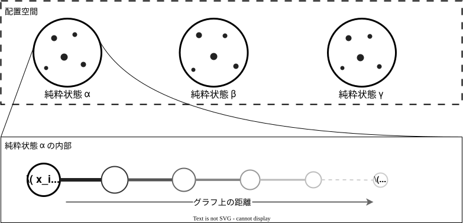

通常の信念伝搬法 (belief propagation, BP) では、一つのBP固定点を求め、その固定点から各変数の周辺分布を近似します。このアルゴリズムは確率分布が次のように因子の積で表されることが必要でした。

$$
   P(\bm{x}) \propto \prod_i \psi_i(x_i) \prod_\mu f_\mu(\bm{x}_{\partial \mu}).
$$

問題設定によっては、問題サイズの大きい極限において、有効的に確率分布が複数のGibbs分布の混合に分裂していくような振る舞いを見せる場合があります。

$$
   P(\bm{x}) \underset{(N \to \infty)}{\propto} \sum_\alpha w_\alpha P_\alpha(\bm{x}).
$$

こういうとき、大雑把には「配置」$\bm{x}$ がクラスターを成していて、それぞれのクラスターが1つのGibbs分布 $P_\alpha(\bm{x})$ に対応する、というようなイメージを持つことができます。

*(上図) Gibbs分布が多数のクラスターに分かれる。(下図) クラスターの内部では、十分遠く離れた変数どうしの相関が小さくなる傾向にある。*

クラスターが多数乱立している場合、それぞれのクラスターごとに異なるBPメッセージが成立し、したがって異なるBP固定点が対応すると考えることができます。通常のBPを一度実行して得られるのは、そのうち一つの固定点です。そのため、通常のBPだけでは、多数のクラスターの様子をうまく表現できないと考えられます。

そこで、一つのBP固定点を求める代わりに、異なるクラスターにわたるBPメッセージの分布を考え、そのBPメッセージの分布を近似的に計算していくというアプローチが考えられます。このようなアプローチを実現するアルゴリズムが、**サーベイ伝搬法 (survey propagation, SP)** です。

本記事では、元の確率分布を複数個複製した確率モデルを構成し、その複製系に通常のBPを適用します。そして、複製系のBPメッセージにレプリカ対称な形を仮定することで、BPの更新式からサーベイの更新式を導出します。

## 信念伝搬法

BPでは、次の因子分解を持つ確率分布の周辺分布を近似的に計算します。

$$
P(\bm{x})
=
\frac{1}{Z}
\prod_i \psi_i(x_i)
\prod_\mu f_\mu(\bm{x}_{\partial \mu}).
$$

ここで、$\psi_i(x_i)$ は変数 $x_i$ のみに依存する単項因子、$f_\mu(\bm{x}_{\partial \mu})$ は複数の変数に依存する因子です。この確率分布に対するBPの更新式は

$$
\begin{aligned}
   \hat{m}_{\mu\to i}^{[t+1]}(x_i)
   &\propto
      \int
      d\bm{x}_{\partial \mu\setminus\{i\}}\,
      f_\mu(\bm{x}_{\partial \mu})
      \prod_{j\in\partial \mu\setminus\{i\}}
      m_{j\to \mu}^{[t]}(x_j),
   \\
   m_{i\to \mu}^{[t+1]}(x_i)
   &\propto
      \psi_i(x_i)
      \prod_{\nu\in\partial i\setminus\{\mu\}}
      \hat{m}_{\nu\to i}^{[t]}(x_i).
\end{aligned}
$$

十分な回数の更新を行って1つの固定点に収束した時、最終的に次式で周辺分布を近似します。

$$
\begin{aligned}
   P(x_i)
   &\propto
      b_i(x_i)
   =
      m_{i\to \mu}^{[t]}(x_i)
\end{aligned}
$$

## アルゴリズム

SPでは、各辺についてBPメッセージそのものを一つ保持する代わりに、そのメッセージの確率分布 $\pi_{i\to \mu}[m_{i\to\mu}]$、$\hat{\pi}_{\mu\to i}[\hat{m}_{\mu\to i}]$ を保持します。

**アルゴリズム (サーベイ伝搬法):**

1. 各辺についてサーベイメッセージ $\pi_{i\to \mu}^{[0]}[m_{i\to\mu}]$ と $\hat{\pi}_{\mu\to i}^{[0]}[\hat{m}_{\mu\to i}]$ を初期化する。

2. サーベイメッセージの変化が十分に小さくなるまで繰り返す:

   1. 因子から変数へのサーベイを更新する。

      $$
      \begin{aligned}
         \hat{\pi}_{\mu\to i}^{[t+1]}[\hat{m}_{\mu\to i}]
         &\propto
            \int
            \prod_{j\in\partial \mu\setminus\{i\}} \mathcal{D}m_{j\to \mu}\,
            \delta\!\left[ \hat{m}_{\mu\to i} - \hat{\mathcal{M}}_{\mu\to i} \right]
            \hat{z}_{\mu \to i}^{s}
            \prod_{j\in\partial \mu\setminus\{i\}}
            \pi_{j\to \mu}^{[t]}\!\left[ m_{j\to \mu} \right],
      \end{aligned}
      $$

      ただし

      $$
      \begin{aligned}
         \hat{\mathcal{M}}_{\mu\to i}
         &=
            \frac{1}{\hat{z}_{\mu \to i}}
            \int d\bm{x}_{\partial \mu\setminus\{i\}}\,
            f_\mu(\bm{x}_{\partial \mu})
            \prod_{j\in\partial \mu\setminus\{i\}}
            m_{j\to \mu}(x_j).
      \end{aligned}
      $$

   2. 変数から因子へのサーベイを更新する。

      $$
      \begin{aligned}
         \pi_{i \to \mu}^{[t+1]}[m_{i\to\mu}]
         &\propto
            \int
            \prod_{\nu\in\partial i\setminus\{\mu\}} \mathcal{D}\hat{m}_{\nu\to i} \,
            \delta\!\left[ m_{i\to\mu} - \mathcal{M}_{i \to \mu} \right]
            z_{i\to \mu}^{s}
            \prod_{\nu\in\partial i\setminus\{\mu\}}
            \hat{\pi}_{\nu\to i}^{[t]}\!\left[ \hat{m}_{\nu \to i} \right],
      \end{aligned}
      $$

      ただし

      $$
      \begin{aligned}
         \mathcal{M}_{i\to \mu}
         &=
            \frac{1}{z_{i\to \mu}}
            \psi_i(x_i)
            \prod_{\nu\in\partial i\setminus\{\mu\}}
            \hat{m}_{\nu\to i}(x_i).
      \end{aligned}
      $$

ここで $\hat{z}_{\mu \to i}$ と $z_{i\to \mu}$ は対応する正規化定数、指数 $s$ は以下で導入するレプリカ数です。

## 導出

### 複製系の信念伝搬法

元の系を $s$ 個「複製」した系を導入します。複製された変数は $\underline{\bm{x}}=(\bm{x}^1,\ldots,\bm{x}^s)$ などのように下線付きで表記することにします。

$$
\begin{aligned}
   P_s(\underline{\bm{x}}) = \prod_{\alpha=1}^{s} P(\bm{x}^\alpha)
\end{aligned}
$$

添字 $\alpha=1,\ldots,s$ をレプリカ添字と呼ぶことにします。この確率分布は次のように因子への分解を持ちます。

$$
\begin{aligned}
   P_s(\{\underline{x}_i\})
   &\propto
      \prod_i
      \Psi_i(\underline{x}_i)
      \prod_\mu
      F_\mu(\underline{\bm{x}}_{\partial \mu}),
\end{aligned}
$$

ただし

$$
\begin{aligned}
   \Psi_i(\underline{x}_i)
   &=
      \prod_{\alpha=1}^{s}\psi_i(x_i^\alpha),
   \\
   F_\mu(\underline{\bm{x}}_{\partial \mu})
   &=
      \prod_{\alpha=1}^{s} f_\mu(\bm{x}_{\partial \mu}^\alpha).
\end{aligned}
$$

この複製系に対するBPの更新式は次のとおりです。

$$
\begin{aligned}
   \hat{M}_{\mu\to i}(\underline{x}_i)
   &\propto
      \int
      d\underline{\bm{x}}_{\partial \mu\setminus\{i\}}\,
      \prod_{\alpha=1}^{s}
      f_\mu(\bm{x}_{\partial \mu}^\alpha)
      \prod_{j\in\partial \mu\setminus\{i\}}
      M_{j\to \mu}(\underline{x}_j),
   \\
   M_{i\to \mu}(\underline{x}_i)
   &\propto
      \prod_{\alpha=1}^{s}\psi_i(x_i^\alpha)
      \prod_{\nu\in\partial i\setminus\{\mu\}}
      \hat{M}_{\nu\to i}(\underline{x}_i).
\end{aligned}
$$

### レプリカ対称性

複製系の確率分布に対し、適当な置換 $\sigma$ を持ってきて、$(x_i^1, \dots, x_i^s)$ を $(x_i^{\sigma(1)}, \dots, x_i^{\sigma(s)})$ のように置き換えても、複製系の因子 $\Psi_i(\underline{x}_i)$ と $F_\mu(\underline{\bm{x}}_{\partial \mu})$ は変化しません。このため、複製系においてレプリカ添字を入れ替えても、確率分布 $P(\underline{\bm{x}})$ は変化しません。このような添字入れ替えに対する対称性が、複製系のBPメッセージにも反映されると考えることは、それほど不自然なことではないはずです。そこで、複製系のBP固定点に次の対称性を仮定します。

**レプリカ対称性の仮定:** 複製系のBPメッセージを次のように仮定します。

$$
\begin{aligned}
   \hat{M}_{\mu\to i}(\underline{x}_i)
   &=
      \int
      \mathcal{D}\hat{m}_{\mu\to i}\,
      \hat{\pi}_{\mu\to i}[\hat{m}_{\mu\to i}]
      \prod_{\alpha=1}^{s}
      \hat{m}_{\mu\to i}(x_i^\alpha),
   \\
   M_{i\to \mu}(\underline{x}_i)
   &=
      \int
      \mathcal{D}m_{i\to \mu}\,
      \pi_{i\to \mu}[m_{i\to \mu}]
      \prod_{\alpha=1}^{s}
      m_{i\to \mu}(x_i^\alpha).
\end{aligned}
$$

汎関数 $\pi_{i\to \mu}[m_{i\to \mu}]$ は、メッセージ $m_{i\to \mu}(\cdot)$ の空間上に定義された確率分布を表しています。式の上では、一つのメッセージ $m_{i\to \mu}$ を「確率分布の分布」から生成し、その条件のもとですべてのレプリカを独立に生成するという形式となっています。

$$
\begin{aligned}
   m_{i \to \mu} \sim \pi_{i\to \mu},
   \qquad
   x_i^\alpha \sim m_{i \to \mu}
   \quad (\alpha=1,\ldots,s).
\end{aligned}
$$

以降は、$\pi_{i\to \mu}$ や $\pi_{\mu\to i}$ を **サーベイ** と呼ぶことにします。

**注意:** 最もナイーブな仮定は、単純に次のように仮定することでしょう。この場合、すべてのレプリカが同じBPメッセージに従うことになり、更新式は複製前の系のBP更新式に帰着します。

$$
M_{i\to \mu}(\underline{x}_i)
=
\prod_{\alpha=1}^{s}
m_{i\to \mu}(x_i^\alpha)
$$

### 因子から変数へのサーベイ

まず、複製系の因子から変数へのBP更新式を考えます。

$$
\hat{M}_{\mu\to i}(\underline{x}_i)
\propto
\int
d\underline{\bm{x}}_{\partial \mu\setminus\{i\}}\,
\prod_{\alpha=1}^{s}
f_\mu(\bm{x}_{\partial \mu}^\alpha)
\prod_{j\in\partial \mu\setminus\{i\}}
M_{j\to \mu}(\underline{x}_j).
$$

右辺に $M_{j \to \mu}(\underline{x}_j)$ のレプリカ対称性の仮定を代入すると、

$$
\begin{aligned}
   \hat{M}_{\mu\to i}(\underline{x}_i)
   &\propto
      \int
      \prod_{j\in\partial \mu\setminus\{i\}}
      \mathcal{D}m_{j\to \mu}
   \\
   &\quad\times
      \prod_{\alpha=1}^{s}
      \underbrace{
         \left[
            \int
            d\bm{x}_{\partial \mu\setminus\{i\}}^\alpha\,
            f_\mu(\bm{x}_{\partial \mu}^\alpha)
            \prod_{j\in\partial \mu\setminus\{i\}}
            m_{j\to \mu}(x_j^\alpha)
         \right]
      }_{\hat{z}_{\mu \to i} \hat{m}_{\mu \to i}}
      \prod_{j\in\partial \mu\setminus\{i\}}
      \pi_{j\to \mu}[m_{j\to \mu}].
\end{aligned}
$$

角括弧の中身は、通常のBPにおける因子から変数へのメッセージ $\hat{m}_{\mu \to i}(x_i)$ の更新式と同じ形をしています。そこで、この部分を次のように定義します。

$$
\begin{aligned}
   \hat{\mathcal{M}}_{\mu\to i}(x_i)
   &=
      \frac{1}{\hat{z}_{\mu \to i}}
      \int d\bm{x}_{\partial \mu\setminus\{i\}}\,
      f_\mu(\bm{x}_{\partial \mu})
      \prod_{j\in\partial \mu\setminus\{i\}}
      m_{j\to \mu}(x_j),
   \\
   \hat{z}_{\mu \to i}
   &=
      \int dx_i
      \int d\bm{x}_{\partial \mu\setminus\{i\}}\,
      f_\mu(\bm{x}_{\partial \mu})
      \prod_{j\in\partial \mu\setminus\{i\}}
      m_{j\to \mu}(x_j).
\end{aligned}
$$

そして $\hat{m}_{\mu \to i} = \hat{\mathcal{M}}_{\mu \to i}$ が成り立つように、次のデルタ汎関数を挿入して関係性を固定しておきます。

$$
\begin{aligned}
   \mathcal{P}[\hat{m}_{\mu \to i} \mid \{m_{j\to \mu}\}]
   &=
      \delta\!\left[
         \hat{m}_{\mu \to i}
         -
         \hat{\mathcal{M}}_{\mu\to i}
      \right].
\end{aligned}
$$

この定義により、各レプリカの角括弧は $\hat{z}_{\mu \to i}\hat{m}_{\mu\to i}(x_i^\alpha)$ と書けるので、

$$
\begin{aligned}
   \hat{M}_{\mu\to i}(\underline{x}_i)
   &\propto
      \int
      \mathcal{D}\hat{m}_{\mu\to i}\,
      \prod_{\alpha=1}^{s}
      \hat{m}_{\mu\to i}(x_i^\alpha)
   \\
   &\quad
      \underline{
         \int
         \prod_{j\in\partial \mu\setminus\{i\}}
         \mathcal{D}m_{j\to \mu}\,
         \delta\!\left[
            \hat{m}_{\mu \to i} - \hat{\mathcal{M}}_{\mu\to i}
         \right]
         \hat{z}_{\mu \to i}^{s}
         \prod_{j\in\partial \mu\setminus\{i\}}
         \pi_{j\to \mu}[m_{j\to \mu}]
      }_{
         {} \propto \hat{\pi}_{\mu\to i}[\hat{m}_{\mu\to i}]
      }.
\end{aligned}
$$

この式と、$\hat{M}_{\mu \to i}$ のレプリカ対称性の式を比較すると、下線部が $\hat{\pi}_{\mu\to i}[\hat{m}_{\mu\to i}]$ に相当するものということが分かります。こうして次の更新式が得られます。

$$
\boxed{
\begin{aligned}
   \hat{\pi}_{\mu\to i}[\hat{m}_{\mu\to i}]
   &\propto
      \int
      \prod_{j\in\partial \mu\setminus\{i\}}
      \mathcal{D}m_{j\to \mu}\,
      \delta\!\left[
         \hat{m}_{\mu \to i} - \hat{\mathcal{M}}_{\mu\to i}
      \right]
      \hat{z}_{\mu \to i}^{s}
      \prod_{j\in\partial \mu\setminus\{i\}}
      \pi_{j\to \mu}[m_{j\to \mu}].
\end{aligned}
}
$$

### 変数から因子へのサーベイ

変数から因子へのサーベイも、因子から変数へのサーベイと全く同じ方法で導出できます。同様に、複製系の変数から因子へのBP更新式から出発します。

$$
M_{i\to \mu}(\underline{x}_i)
\propto
\prod_{\alpha=1}^{s}
\psi_i(x_i^\alpha)
\prod_{\nu\in\partial i\setminus\{\mu\}}
\hat{M}_{\nu\to i}(\underline{x}_i).
$$

右辺に $\hat{M}_{\nu\to i}(\underline{x}_i)$ のレプリカ対称性の仮定を代入すると、

$$
\begin{aligned}
   M_{i\to \mu}(\underline{x}_i)
   &\propto
      \int
      \prod_{\nu\in\partial i\setminus\{\mu\}}
      \mathcal{D}\hat{m}_{\nu\to i}
   \\
   &\quad\times
      \prod_{\alpha=1}^{s}
      \underbrace{
         \left[
            \psi_i(x_i^\alpha)
            \prod_{\nu\in\partial i\setminus\{\mu\}}
            \hat{m}_{\nu\to i}(x_i^\alpha)
         \right]
      }_{z_{i\to \mu} m_{i\to \mu}}
      \prod_{\nu\in\partial i\setminus\{\mu\}}
      \hat{\pi}_{\nu\to i}[\hat{m}_{\nu\to i}].
\end{aligned}
$$

角括弧の中身に対して次の関数とデルタ汎関数を導入します。

$$
\begin{aligned}
   \mathcal{M}_{i\to \mu}(x_i)
   &=
      \frac{1}{z_{i\to \mu}}
      \psi_i(x_i)
      \prod_{\nu\in\partial i\setminus\{\mu\}}
      \hat{m}_{\nu\to i}(x_i),
   \\
   z_{i\to \mu}
   &=
      \int dx_i\,
      \psi_i(x_i)
      \prod_{\nu\in\partial i\setminus\{\mu\}}
      \hat{m}_{\nu\to i}(x_i),
\end{aligned}
\\
\begin{aligned}
   \mathcal{P}[m_{i\to\mu}\mid\{\hat{m}_{\nu\to i}\}]
   &=
      \delta\!\left[
         m_{i\to\mu}
         -
         \mathcal{M}_{i\to\mu}
      \right].
\end{aligned}
$$

すると今度は各レプリカの角括弧部分を $z_{i\to\mu}m_{i\to\mu}(x_i^\alpha)$ と書けるので、

$$
\begin{aligned}
   M_{i\to \mu}(\underline{x}_i)
   &\propto
      \int
      \mathcal{D}m_{i\to\mu}\,
      \prod_{\alpha=1}^{s}
      m_{i\to\mu}(x_i^\alpha)
   \\
   &\quad
      \underline{
         \int
         \prod_{\nu\in\partial i\setminus\{\mu\}}
         \mathcal{D}\hat{m}_{\nu\to i}\,
         \delta\!\left[
            m_{i\to\mu}-\mathcal{M}_{i\to\mu}
         \right]
         z_{i\to\mu}^{s}
         \prod_{\nu\in\partial i\setminus\{\mu\}}
         \hat{\pi}_{\nu\to i}[\hat{m}_{\nu\to i}]
      }_{
         {}\propto \pi_{i\to\mu}[m_{i\to\mu}]
      }.
\end{aligned}
$$

この式と $M_{i\to\mu}$ のレプリカ対称性の式を比較することで、

$$
\boxed{
\begin{aligned}
   \pi_{i\to \mu}[m_{i\to\mu}]
   &\propto
      \int
      \prod_{\nu\in\partial i\setminus\{\mu\}}
      \mathcal{D}\hat{m}_{\nu\to i}\,
      \delta\!\left[
         m_{i\to\mu}-\mathcal{M}_{i\to\mu}
      \right]
      z_{i\to\mu}^{s}
      \prod_{\nu\in\partial i\setminus\{\mu\}}
      \hat{\pi}_{\nu\to i}[\hat{m}_{\nu\to i}].
\end{aligned}
}
$$

これで、複製系のBPから二種類のサーベイ分布の更新式が得られました。

## 解釈
### パラメータ $s$ について

SPの更新式には、$\hat{z}_{\mu \to i}^{s}$ と $z_{i\to \mu}^{s}$ という2種類の重みがあります。この $s$ は、元々はレプリカ数を表す正の整数として導入したもので、導出過程において次のような形で現れたのでした。

$$
\begin{aligned}
   \prod_{\alpha=1}^{s}
   \left[z\,m(x^\alpha)\right]
   &=
      z^s
      \prod_{\alpha=1}^{s}
      m(x^\alpha)
\end{aligned}
$$

ところが、サーベイ更新式の形は、もはや $s$ が正の整数であることに依存しない形になっています。

$$
\begin{aligned}
   \hat{\pi}_{\mu\to i}[\hat{m}_{\mu\to i}]
   &\propto
      \int
      \prod_{j\in\partial \mu\setminus\{i\}}
      \mathcal{D}m_{j\to \mu}\,
      \delta\!\left[
         \hat{m}_{\mu \to i} - \hat{\mathcal{M}}_{\mu\to i}
      \right]
      \hat{z}_{\mu \to i}^{s}
      \prod_{j\in\partial \mu\setminus\{i\}}
      \pi_{j\to \mu}[m_{j\to \mu}],
   \\
   \pi_{i\to \mu}[m_{i\to\mu}]
   &\propto
      \int
      \prod_{\nu\in\partial i\setminus\{\mu\}}
      \mathcal{D}\hat{m}_{\nu\to i}\,
      \delta\!\left[
         m_{i\to\mu}-\mathcal{M}_{i\to\mu}
      \right]
      z_{i\to\mu}^{s}
      \prod_{\nu\in\partial i\setminus\{\mu\}}
      \hat{\pi}_{\nu\to i}[\hat{m}_{\nu\to i}].
\end{aligned}
$$

そこで、$s$ を実数に解析接続し、異なるBP固定点をどのような重みでサーベイに寄与させるかを制御するパラメータとみなすことができます。

とくに $s=0$ とすると、正規化定数による再重み付けが消滅し、すべてのBP固定点を等しい重みでサーベイに寄与させることになります。SPという場合、一般的にはこの形を指すことが多いと思います。

$$
\begin{aligned}
   \hat{\pi}_{\mu\to i}[\hat{m}_{\mu\to i}]
   &\propto
      \int
      \prod_{j\in\partial \mu\setminus\{i\}}
      \mathcal{D}m_{j\to \mu}\,
      \delta\!\left[
         \hat{m}_{\mu \to i} - \hat{\mathcal{M}}_{\mu\to i}
      \right]
      \prod_{j\in\partial \mu\setminus\{i\}}
      \pi_{j\to \mu}[m_{j\to \mu}],
   \\
   \pi_{i\to \mu}[m_{i\to\mu}]
   &\propto
      \int
      \prod_{\nu\in\partial i\setminus\{\mu\}}
      \mathcal{D}\hat{m}_{\nu\to i}\,
      \delta\!\left[
         m_{i\to\mu}-\mathcal{M}_{i\to\mu}
      \right]
      \prod_{\nu\in\partial i\setminus\{\mu\}}
      \hat{\pi}_{\nu\to i}[\hat{m}_{\nu\to i}].
\end{aligned}
$$

### BPとSPの関係

BPでは次のようなメッセージの更新が行われていきます。

$$
\{m_{j\to \mu}\}
\overset{\hat{\mathcal{M}}_{\mu\to i}}{\longmapsto}
\hat{m}_{\mu\to i}
$$

他方、SPではメッセージ $\{m_{j\to \mu}\}$ 自体を、更なる高階の分布であるサーベイ分布に従う確率変数と考え、サーベイを更新していくこととなります。

$$
\{\pi_{j\to \mu}\}
\longmapsto
\hat{\pi}_{\mu\to i}
$$

キャビティ法という観点からも似た解釈ができます。通常のBPでは、1つの辺 $(i, \mu)$ に対して $m_{i\to \mu}(x_i)$ という一つのキャビティ分布を計算するのに対し、SPでは、次のように様々なBP固定点に対応する多数のキャビティ分布を扱っているのだと考えることができます。

$$
m_{i\to \mu}^{(1)},
m_{i\to \mu}^{(2)},
m_{i\to \mu}^{(3)},
\ldots
$$

そしてSPではこれらの分布を $\pi_{i\to \mu}[m]$ と書いて、それを伝搬させていっています。キャッチーに言うなら次のようなものでしょう。

- BPでは、キャビティ分布を伝搬させる
- SPでは、キャビティ分布の分布を伝搬させる

## おまけ: 周辺分布のサーベイについて

BPでは最終的に周辺分布を近似する $b_i(x_i)$ を計算します。これに対応して、SPでも各辺のBPメッセージの分布を計算することによって「周辺分布の分布」を形式的に構成できます。

因子から変数へのメッセージを $\{\hat{m}_{\mu\to i}\}_{\mu\in\partial i}$ とすると、$b_i$ の更新結果は次式で表されます。

$$
\begin{aligned}
   b_i(x_i)
   &=
      \frac{1}{z_i}
      \psi_i(x_i)
      \prod_{\mu\in\partial i}
      \hat{m}_{\mu\to i}(x_i),
   \\
   z_i
   &=
      \int dx_i\,
      \psi_i(x_i)
      \prod_{\mu\in\partial i}
      \hat{m}_{\mu\to i}(x_i).
\end{aligned}
$$

上の第1式右辺を $\mathcal{B}_i(x_i)$ と書くことにします。すると、周辺分布の分布 $\pi_i[b_i]$ は、次のように定義できます。

$$
\begin{aligned}
   \pi_i[b_i]
   &\propto
      \int
      \prod_{\mu\in\partial i}
      \mathcal{D}\hat{m}_{\mu\to i}\,
      z_i^s
      \delta
      \left[
         b_i(x_i)
         -
         \mathcal{B}_i(x_i)
      \right]
      \prod_{\mu\in\partial i}
      \hat{\pi}_{\mu\to i}[\hat{m}_{\mu\to i}]
\end{aligned}
$$
